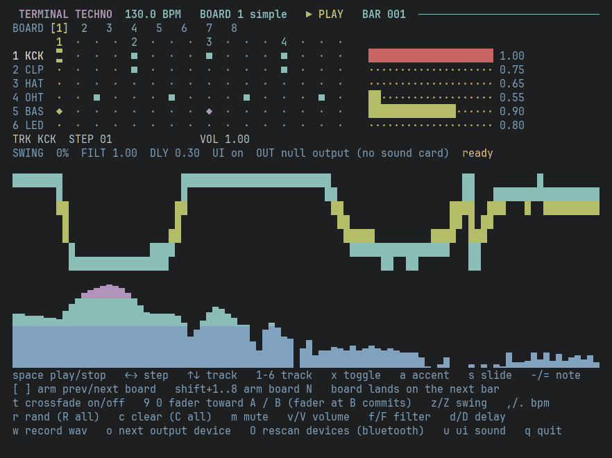
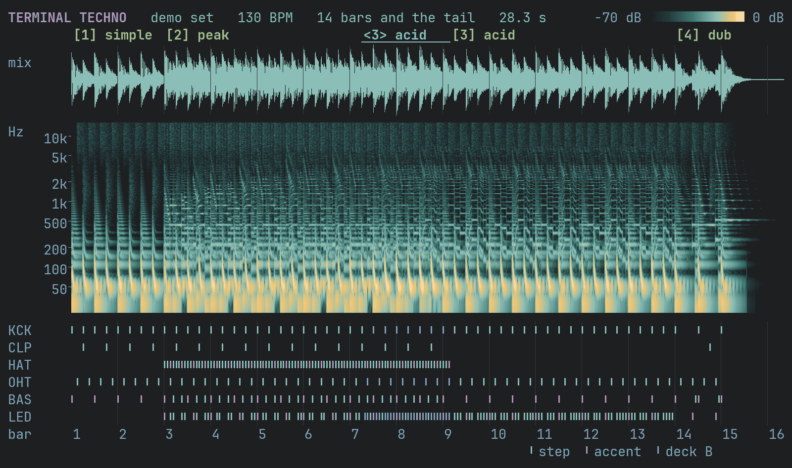
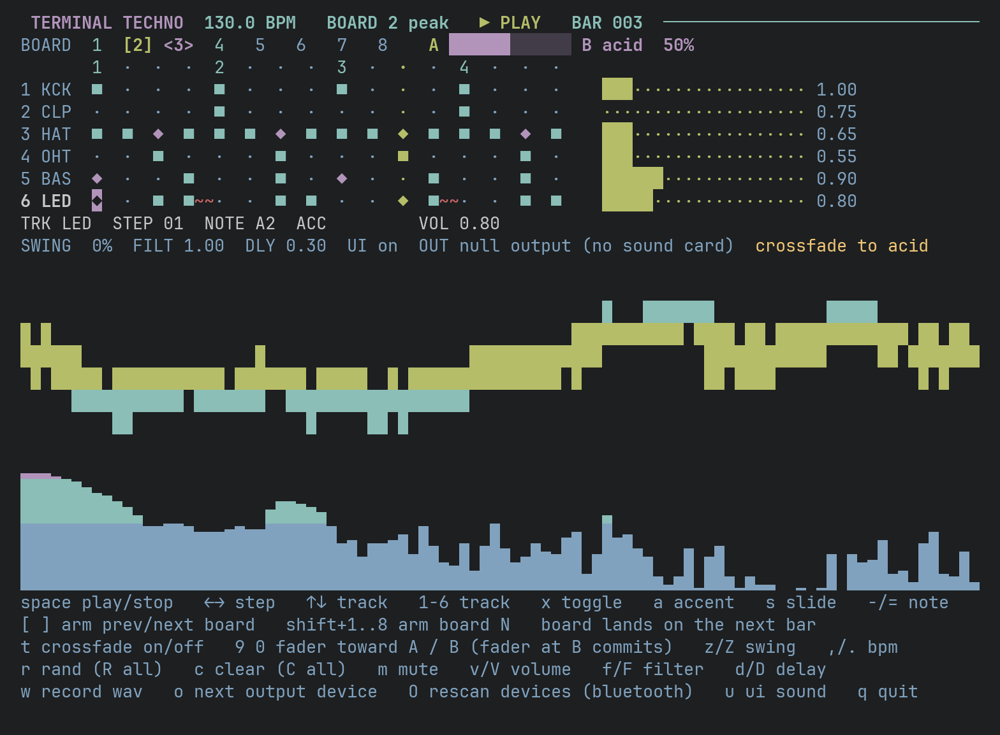

# Terminal Techno

A live techno sequencer that runs in your terminal. Six tracks, sixteen steps, eight boards you swap on the bar line or crossfade between. Every sound is synthesised from scratch in numpy and scipy, no samples.



That is the real interface, recorded from a run inside a pseudo-terminal with no sound card behind it (the status line says `null output`). Full size frame: [docs/tui.png](docs/tui.png).

## Hear it without installing anything

[docs/demo.mp3](docs/demo.mp3) is 28 seconds of stereo audio (128 kbps MP3, 444 KB) played through the real engine and rendered offline by [tools/render_demo.py](tools/render_demo.py). Two bars of board 1, board 2 queued in with the acid filter opening, a two-bar crossfade into board 3, the delay mix raised, board 4 on bar 14, then stop and let the tails ring out. Nothing is added after the engine: no mastering, no extra effects. Rendering it twice here gave byte-identical files.



Top: the mix. Middle: a spectrogram of it, log frequency, 70 dB below the loudest frame. Bottom: every trigger the sequencer fired, taken from the engine itself (cyan for a step, magenta for an accent, blue for deck B while it fades in). The kick's pitch drop is the falling streaks under 200 Hz and the acid filter is the arcs between 500 Hz and 4 kHz. The hats stop when the crossfade completes, because board 3 has none.

To make your own, `--bounce` needs only numpy and scipy, no PortAudio and no sound card:

```sh
python techno.py --bounce peak.wav --board 2 --bars 8    # 14.8 s of the "peak" board
```

## Run it

Python 3.11 or newer. Live sound also needs PortAudio. The `sounddevice` wheel bundles it on macOS; on Debian and Ubuntu it is the `libportaudio2` package (I have not run live audio on Linux).

```sh
git clone https://github.com/matuskalis/terminal-techno.git
cd terminal-techno
python3 -m venv .venv && .venv/bin/pip install -r requirements.txt

./run.sh                     # board 1 at 130 BPM, playing; space stops and starts
./run.sh --board 2 --bpm 140
./run.sh --list-devices
```

The terminal needs to be at least 60 by 24. A bigger one gives the scope and spectrum more rows, and from 92 columns the step grid gets wider cells. Without PortAudio the app says so and points at `--bounce` instead of printing a traceback.

## What is on the screen



- **Title bar:** tempo, live board, transport, bar count.
- **Board strip:** `[n]` is live, `(n)` is armed and lands on the next bar with a countdown, `<n>` is on deck B. During a crossfade the fader runs from A to B.
- **Step grid:** `■` a step, `◆` an accent, `~` a slide. The bright step is the playhead, the reversed one is your cursor. Each track has a level meter and its volume on the right.
- **Info and status lines:** the cursor's track, step, note, accent and slide flags; swing, filter, delay, output device, and the last thing you did.
- **Scope:** the last 1024 samples (21 ms) of the mix with automatic gain. **Spectrum:** a 2048-point FFT on a log axis from 45 Hz to 15 kHz, tilted so the hats stay visible next to the kick.

## Signal path

Six voices in [dsp.py](dsp.py), mixed and sequenced in [engine.py](engine.py). Times are time constants of `exp(-t / tau)` envelopes, measured from the trigger.

| Track | Voice | Parameters |
| --- | --- | --- |
| KCK | sine with a falling pitch, soft-clipped, plus a noise click | pitch `48 + 95 exp(-t/32 ms)` Hz, so 143 Hz falling to 48 Hz; `tanh(2.3 sin)`; body decay 170 ms; click decay 3 ms at 0.35 |
| CLP | band-passed white noise, three bursts then a tail | band-pass 1.5 kHz, Q 1.1; bursts `exp(-(t mod 11 ms)/2.8 ms)` for 33 ms, then a 115 ms tail |
| HAT, OHT | white noise through a high-pass | high-pass 7.2 kHz, Q 0.9; decay 42 ms closed, 300 ms open |
| BAS | saw plus a sine one octave down, through a swept resonant low-pass | root A1 (55 Hz), sub at 27.5 Hz; Q 1.6; cutoff `130 + 1100 exp(-t/100 ms)` Hz, 2200 on accents; amplitude decay 240 ms; glide 35 ms; `tanh(1.5 x)` |
| LED | 303-style lead: 80% saw, 20% square, resonant low-pass | root A2 (110 Hz); Q 7, plus 3 on accents; cutoff `250 + 1900 exp(-t/260 ms)` Hz, or `3400` and 160 ms on accents, times the `f`/`F` filter scale; amplitude decay 300 ms; glide 45 ms; `tanh(2.6 x)` |

The filters are RBJ biquads run through `scipy.signal.lfilter`. While a cutoff moves, the coefficients are recomputed every 64 samples (1.3 ms at 48 kHz).

```
 KCK  CLP  HAT  OHT  BAS  LED       six voices, one block at a time
  |    |    |    |    |    |
  +----+----+----+----+----+        per track: volume, constant-power pan
          |            |
       dry bus      send bus        sends: CLP .28  HAT .10  OHT .22  BAS .05  LED .55  KCK 0
          |            |
          |      ping-pong delay    dotted eighth (346 ms at 130 BPM), feedback 0.33
          |            |
          +--- mix 0.30 +
                  |
          tanh(0.9 x sum)           master soft clip; recording taps here
                  |
             + key click            UI sounds, added after the tap
                  |
             sound card
```

Default pans: CLP +0.15, HAT -0.25, OHT +0.30, LED -0.10, the rest centre. Default volumes: KCK 1.00, CLP 0.75, HAT 0.65, OHT 0.55, BAS 0.90, LED 0.80.

The clock turns `60 / bpm / 4` seconds into samples and `Engine.render()` cuts its chunks exactly on step boundaries, so a step fires within one sample of its exact position whatever block size the sound card asks for. Swing lengthens the even 16ths by `1 + s` and shortens the odd ones by `1 - s`, so the bar keeps its length.

## Boards and crossfade

Eight boards, each a full six-track scene. Four ship filled (`simple`, `peak`, `acid`, `dub`), boards 5 to 8 start empty for you to build with `r` and `x`. Editing always targets the live board.

- **Queued swap.** `[` `]` or `shift`+digit arms a board. It lands on the next bar line, so the change is on the beat.
- **Crossfade.** `t` loads the armed board onto deck B, a second bank of six voices, and runs both boards at once. `9` and `0` move the fader 5% at a time with gains `cos(x pi/2)` for deck A and `sin(x pi/2)` for deck B, which holds the level for unrelated material. Twenty presses reach B and commit: deck B becomes the live board and its voices keep ringing through the swap. `t` again cancels.

## Keys

| key | action |
| --- | --- |
| `space` | play / stop |
| `←` `→` or `h` `l` | move the step cursor |
| `↑` `↓` or `k` `j` | move the track cursor |
| `1`-`6` | jump to a track |
| `x` or `enter` | toggle the step |
| `a` | accent: velocity 1.0 instead of 0.72, and a brighter filter peak on BAS and LED |
| `s` | slide (BAS and LED): the note glides in from the previous one instead of jumping |
| `-` `=` | note down / up on the selected step (BAS and LED, -12 to +24 semitones) |
| `,` `.` | BPM -1 / +1 (`<` `>` for 5), range 60 to 200 |
| `[` `]` | arm previous / next board |
| `shift`+`1`..`8` | arm board 1 to 8 |
| `t` | crossfade on / off (deck B is the armed board, or the next one) |
| `9` `0` | fader toward A / toward B; reaching B commits |
| `m` | mute the selected track |
| `v` `V` | track volume down / up |
| `r` `R` | randomise the selected track / all tracks |
| `c` `C` | clear the selected track / all tracks |
| `f` `F` | acid filter cutoff scale down / up (0.15 to 2.5) |
| `d` `D` | delay mix down / up |
| `z` `Z` | swing down / up, 0 to 35% |
| `w` | start / stop recording to `rec-<timestamp>.wav` next to the code |
| `o` | next output device |
| `O` | rescan devices, then open the system default (after connecting Bluetooth) |
| `u` | mute / unmute the key clicks |
| `q` | quit |

## Output device

The app opens the system default output at launch and checks it every two seconds, so changing the output in Sound settings moves the audio over by itself. A device that connects after launch (Bluetooth headphones, a dock) is invisible to PortAudio until it is re-initialised, and `O` does that. All device work runs off the UI thread, because opening a device that is not really there can block for ten seconds.

## Performance

Measured on a MacBook Pro with an M1 Pro, Python 3.11.14, numpy 2.4.6, scipy 1.17.1, 48 kHz, 1024-frame blocks, while the machine was busy with other jobs (load average near 100), so read these as upper bounds. The engine numbers are CPU seconds per second of audio from `time.thread_time()`, best of five 20 second runs, repeated three times with spreads under 0.4 points. Reproduce with `python tools/bench.py`.

| what is running | engine alone | realtime factor | median block | worst block seen | whole app in a terminal |
| --- | --- | --- | --- | --- | --- |
| board 1 (`simple`) | 2.3% | 43x | 0.44 ms | 2.2 ms | 8 to 9% |
| board 2 (`peak`) | 3.3 to 3.7% | 27 to 30x | 0.67 ms | 3.1 ms | 9 to 11% |
| board 2 crossfading to 3 | 6.1 to 6.3% | 16x | 1.22 ms | 3.6 ms | 12 to 13% |

One block is 21.3 ms of audio, so the worst block in any run used 17% of its budget. "Whole app" is the process CPU time from `tools/bench.py --app`, which runs the real `techno.py` in a pseudo-terminal against a null audio device. About 6 points of it are the screen: `Ui.draw` alone makes around 600 `addstr` calls and takes 1.1 ms of CPU per frame (about 3% of a core at 30 frames a second), and the rest is presumably curses writing the frame out, which I did not separate.

Why the engine stays small:

- **A voice renders a whole block at once.** Envelopes are closed-form functions of the time since the trigger and phases are cumulative sums, so there is no Python loop over samples.
- **The filters are C.** `lfilter` does the work. The two swept filters (BAS and LED) still cost half the engine: 27% each in a profile (`python tools/bench.py --profile`), because they make sixteen small calls per block.
- **Silence is nearly free.** A voice that has rung out returns a block of zeros without computing anything.
- **The second deck is what costs.** A crossfade runs twelve voices instead of six and the engine time goes up about 1.8 times.

## Design decisions and what they cost

**Closed-form envelopes instead of a per-sample state machine.** It is what makes the numpy version fast, and it keeps each voice a few lines. The cost: a voice is monophonic and retriggering restarts its envelope, so a new hit cuts the tail of the last one on the same track, and a voice rings for a fixed 1 to 1.5 seconds at most. It also means swept-filter output depends a little on where a render call starts relative to the 64 sample coefficient grid, which the tests account for by using block sizes that are multiples of 64.

**`time.sleep`, never `curses.napms`, in the UI loop.** `napms` holds the GIL, so the PortAudio callback never runs: the stream reports active and the UI animates while the speakers play silence. The cost is a UI loop that wakes every 30 ms. Curses also swallows stderr, so callback errors and underruns go to `techno.log` next to the code.

**Two full voice banks for the crossfade, not one bank with two patterns.** Deck B keeps its own filter state and tails, and committing just swaps the banks, so nothing restarts or clicks at the handover. The cost is the 1.8x CPU in the table above.

## Limits

- Live sound is developed and used on macOS. On Linux the tests, the linter and the offline render run in CI; live playback there is not verified. Windows is not supported (the UI is `curses`).
- Nothing is saved. Boards live in memory, so quitting loses your edits. `w` records the output to a WAV.
- Six fixed tracks, sixteen steps, one velocity per step (accent or not), no MIDI in or out. Sound shaping is limited to the acid filter, the delay mix, swing and track volumes.
- The UI thread edits engine state while the audio callback reads it, with no lock. Single assignments are safe under the GIL, but a multi-step change such as starting or cancelling a crossfade could in principle be seen half done. I have not seen it happen.
- Re-scanning devices calls `sounddevice`'s private `_terminate` and `_initialize`.
- The CPU figures above come from one machine under load. On a quiet one they should be lower, but I have not measured that.

## Tests and CI

```sh
pip install -r requirements-dev.txt
ruff check .
pytest                       # 169 tests in a few seconds
```

The tests open no audio device, no PortAudio and no curses screen. They cover the filters against the RBJ formulas, the pitch, envelope and tone of every voice, seeded determinism, the delay's echo positions and ping-pong sides, every step landing on its exact sample for any block size and swing, board arming on the bar line, the mix bus (headroom, pan law, meters, recording), the crossfade blend checked against `cos(a) * deck A + sin(a) * deck B`, and the offline bounce including its no-PortAudio path. The block-size test found a real bug: the bass voice wrapped its oscillator phase at 1.0 after every render call, but its sub oscillator runs at half the rate and needs 2.0. Whenever the saw had completed an odd number of cycles, the sub flipped sign at the block edge, so the bass sounded different for every block size. It is fixed and stays covered.

GitHub Actions runs `ruff check`, `pytest` and a two-bar `--bounce` on Python 3.11 and 3.13 on Ubuntu, with no PortAudio installed.

## Regenerating the media

```sh
pip install pillow pyte        # and ffmpeg with libmp3lame for the MP3
python tools/render_demo.py                          # docs/demo.mp3 and docs/signal.png
python tools/capture_tui.py --gif docs/tui.gif       # docs/tui.png and docs/tui.gif
```

The screenshot is the app's own output: `tools/capture_tui.py` runs the unchanged `techno.py` in a pseudo-terminal with [tools/null_audio](tools/null_audio/sounddevice.py) standing in for `sounddevice`, reads the screen with the `pyte` terminal emulator, and draws it cell by cell in JetBrains Mono with the Tomorrow Night palette (put the two TTFs in `tools/fonts/`, or pass `--font` and `--bold`). The frame for the still is the fullest one while the fader is near the middle.

## Files

- `dsp.py`: voices (kick, clap, hats, bass, acid) and the ping-pong delay
- `engine.py`: boards and patterns, the step clock, the two-deck mixer; `Engine.render(frames)` is what the audio callback calls
- `tui.py`: curses grid, meters, scope, spectrum, recording and device keys
- `techno.py`: command line, `AudioOut` (stream and device switching), the main loop
- `tests/`: the unit tests. `tools/`: media, benchmark and capture scripts. `docs/`: the pictures and the demo MP3

MIT licence.
